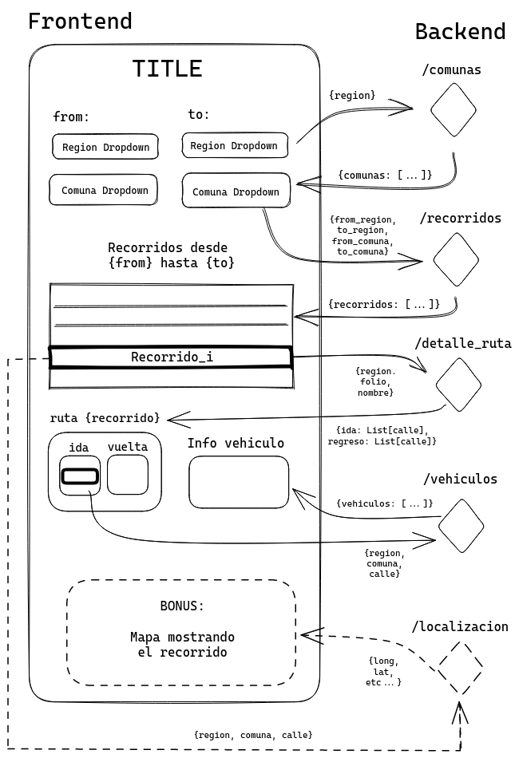

# proyecto-bases-de-datos

Proyecto para el curso CC3201

## Integrantes
 
- [Nicolás Acevedo](https://github.com/nicoacevedor)
- [Catalina Parra](https://github.com/caatabs)
- [Pablo Skewes](https://github.com/pabloskewes/)

## Descripción
El siguiente proyecto tiene un enfoque pedagógico, y se presenta como el proyecto final para el curso Bases de Datos (CC3201) de la Universidad de Chile. Para este trabajo se utilizaron los siguientes datos:  [Parques Vehiculares](https://usuarios.subtrans.gob.cl/estadisticas/parques-vehiculares.html)

El proyecto consiste en una aplicación web que permite buscar recorridos de parques vehiculares en Chile. La aplicación permite ingresar un origen y un destino, y muestra los recorridos que cumplen con estos criterios. Luego, se puede clickear sobre la tabla de recorridos para obtener el detalle de la ruta, es decir, los distintos trazados que componen el recorrido, y finalemente también se pueden clickear los recorridos para obtener información sobre los vehículos que pasan por ese trazado. Como bonus, si nos queda tiempo implementaremos un mapa para ver los recorridos.

El proyecto ya se encuentra en producción en el [servidor](http://grupo10.cc3201.dcc.uchile.cl/), sin embargo es posible que este sea cerrado tras el término del curso, por lo que en tal caso sólo se podría probar la aplicación usando Docker.

## Instalación

Para instalar las dependencias del proyecto, se recomienda utilizar un entorno virtual de python. Para esto, se debe ejecutar el siguiente comando en la carpeta raíz del proyecto:

```bash
python3 -m venv venv
source venv/bin/activate
pip install -r requirements.txt
pip install -e project_logger
```

Para que el backend funcione correctamente, se debe crear un archivo `.env` en la carpeta `backend` con completando la siguiente información (se puede copiar el archivo `.env.example`):

```
SISTEMA=""
USUARIO=""
PASSWORD=""
HOST=""
PUERTO=""
DB=""
```

## Ejecución
Para ejecutar el proyecto, se debe ejecutar el frontend y el backend por separado. Para esto, se deben ejecutar los siguientes comandos en la carpeta raíz del proyecto:

```bash
make run_backend
make run_frontend
```
Estos comandos deberían funcionar para Linux, en caso de tener Windows se tendrá que crear un ambiente virtual de otra forma (opcional) y para poder correr el programa, habrá que entrar a la carpeta `backend` y ejecutar el archivo `main.py`, y en otra terminal entrar a la carpeta `frontend` y ejecutar el archivo `app.py`.

Tras esto, se puede acceder al frontend en el puerto 8090 y al backend en el puerto 8091.

## Documentación

### Estructura del proyecto
El proyecto está dividido en tres partes: frontend, backend y base de datos. Cada una de estas partes está en una carpeta distinta. Además, se incluye una carpeta `project_logger` que contiene un paquete creado para el proyecto que permite crear logs en el frontend y el backend. A demás, también se incluyó nginx para servir los archivos estáticos del frontend. La aplicación está dockerizada y se puede ejecutar con docker-compose, en este caso se crea la base de datos de forma local en lugar de usar la base de datos que se encuentra en el servidor.
La estructura del proyecto es la siguiente:

```
proyecto-bases-de-datos
├── backend # Backend de la aplicación
├── database # Base de datos de la aplicación
├── frontend # Frontend de la aplicación
├── nginx # Nginx para servir los archivos estáticos del frontend
├── project_logger # Paquete para crear logs en el frontend y el backend
├── docker-compose.yml # Docker-compose para ejecutar la aplicación
├── Makefile # Makefile para ejecutar la aplicación
├── README.md # README del proyecto
```

A continuación se presenta un esquema de la interacción entre el frontend y el backend:



### Frontend
El frontend está desarrollado en Dash, una librería de Python para crear aplicaciones web.
La estructura del frontend es la siguiente:

```
frontend
├── app.py # Archivo principal del frontend
├── assets # Archivos estáticos
│   ├── header.css
├── logs # Logs del frontend
├── data # Datos usados en la aplicación
│   ├──  regiones.json # Regiones de Chile en formato GeoJSON
├── src # Código fuente del frontend
│   ├── components # Componentes de Dash
│   │   ├── __init__.py
│   │   ├── layout.py # Layout de la aplicación
│   │   ├── buscador_recorrido.py # Componente del buscador de recorridos
│   │   ├── tabla_recorridos.py # Componente de la tabla de recorridos
│   │   ├── detalle_ruta.py # Componente del detalle de la ruta
│   │   ├── vehiculos_info.py # Componente de la información de los vehículos
│   ├── ids.py # Identificadores de los componentes
│   ├── logger.py # Logger del frontend
│   ├── utils.py # Funciones de utilidad
|   ├── client.py # Cliente del backend
|   ├── mock_client.py # Cliente del backend para pruebas
|   ├── dto.py # DTOs para comunicación con el backend
│   ├── __init__.py
├── Dockerfile # Dockerfile del frontend
├── requirements.txt # Dependencias del frontend
```

### Backend
El backend está desarrollado con FastAPI y SQLAlchemy. La estructura del backend es la siguiente:

```
backend
├── main.py # Archivo principal del backend
├── logs # Logs del backend
├── src # Código fuente del backend
│   ├── __init__.py
│   ├── database.py # Configuración/conexión de la base de datos
│   ├── models.py # Modelos de la base de datos (ORM)
│   ├── logger.py # Logger del backend
│   ├── schemas.py # Schemas de los modelos (Pydantic)
│   ├── crud.py # Funciones de acceso a la base de datos
│   ├── routes # Rutas del backend
│── __init__.py
|── .env # Archivo de configuración: contiene la información de la base de datos
├── Dockerfile # Dockerfile del backend
├── requirements.txt # Dependencias del backend
```

### Base de datos
La base de datos está desarrollada en PostgreSQL. En el siguiente directorio se encuentra el script para crear la base de datos en Docker:

```
database
├── Dockerfile # Dockerfile de la base de datos
├── init.sql # Script para crear la base de datos
├── .env # Archivo de configuración: contiene la información de la base de datos
|── data # Archivos csv que se usan para crear la base de datos (no se incluyen en el repositorio)
```
